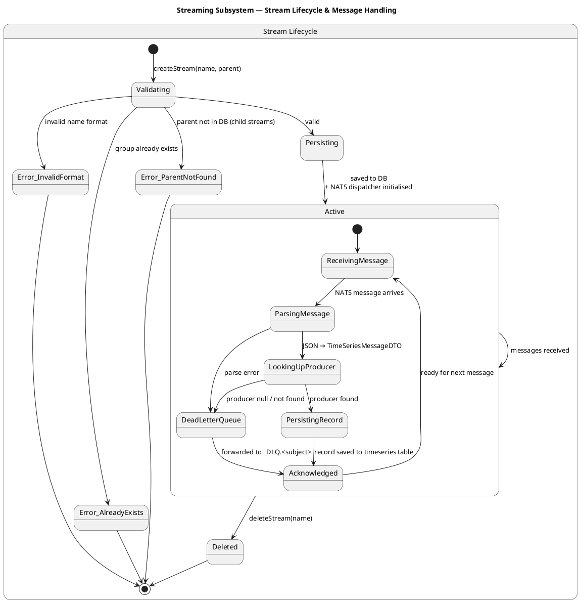

# Streaming Subsystem

## Stream Lifecycle & Message Handling

---

## State Descriptions

### Stream Lifecycle

| State | Description |
|---|---|
| **Validating** | Entry point. Checks name format, uniqueness, and parent existence (for child streams). |
| **Persisting** | Stream record is written to the database and the NATS dispatcher is initialised. |
| **Active** | Stream is live and accepting messages. |
| **Deleted** | Stream has been removed via `deleteStream(name)`. Terminal state. |
| **Error_InvalidFormat** | Name did not pass format validation. Terminal state. |
| **Error_AlreadyExists** | A group with this name already exists. Terminal state. |
| **Error_ParentNotFound** | The specified parent group was not found in the database. Terminal state. |

### Message Handling (inside Active)

| State | Description |
|---|---|
| **ReceivingMessage** | Idle, waiting for the next NATS message. |
| **ParsingMessage** | Deserialises the raw NATS payload into a `TimeSeriesMessageDTO`. |
| **LookingUpProducer** | Resolves the producer associated with the incoming message. |
| **PersistingRecord** | Writes the validated time-series record to the database. |
| **DeadLetterQueue** | Handles failed messages (parse error or unknown producer) by forwarding to `_DLQ.<subject>`. |
| **Acknowledged** | Message processing is complete. Returns to `ReceivingMessage`. |
